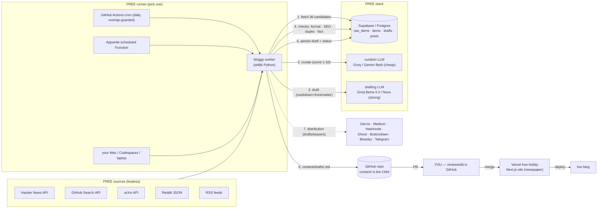

# Architecture — Bloggy v2 (free stack: GitHub Actions + Appwrite/Supabase + Vercel)

## System view

## Free vs paid — every component

| Concern | Paid path (avoided) | Free path (implemented) |
|---|---|---|
| Orchestrator | n8n cloud / DigitalOcean droplet | GitHub Actions cron (free; public repos unlimited), or Appwrite Function, or your Mac |
| Curation model | Claude Haiku | Groq `llama-3.3-70b-versatile` · Gemini flash via OpenAI-compatible endpoint · OpenRouter `:free` · Nous |
| Drafting model | Claude Sonnet | same endpoints, stronger model name (per-stage `LLM_SCORE_MODEL` vs `OPENAI_MODEL`) |
| Database | — | Supabase free (Postgres + REST + pgvector dedupe) |
| Blog host | — | Vercel hobby · static export, deploys on git push |
| CMS | CMS SaaS | `content/*.md` in git — PRs are the editorial system |
| Distribution | X API ($200+/mo) | Dev.to / Medium / Hashnode / Ghost (drafts) · Buttondown (newsletter) · Bluesky (open protocol) · Telegram |
| Dev space | — | GitHub Codespaces free (`.devcontainer/` included) |

## Data flow (matches your plan: raw → scored → drafted → reviewed → published)

1. **Ingestion** — worker fetches 4 free sources serially (HN, GitHub trending,
   arXiv, Reddit + RSS); every source is isolated — a failure returns `[]`, never
   kills the run. Writes to `raw_items`.
2. **Curation** — cheap LLM scores each candidate 1–10 (relevance/freshness/
   novelty); below `LLM_SCORE_THRESHOLD` (6) the day produces nothing. Heuristic
   scorer (recency + engagement + topic-fit) is the zero-key fallback. → `items`
   `status=scored`.
3. **Drafting** — strong LLM writes the article (structured prompt: hook, context,
   sourced claims, takeaways) in newspaper house style with validated frontmatter.
   → `posts` `status=draft`.
4. **Checks** — format (frontmatter, length, structure) · SEO (title ≤70, desc
   130–160) · duplicate (n-gram + pgvector optional) · fact-check pass (LLM, only
   allowed to cite the source). One fail blocks publishing.
5. **Review** — `content/drafts/<slug>.md` → branch → GitHub PR. You review/edit
   in GitHub (the workflow you already run), merge → Vercel deploys. Nothing
   publishes itself by default (`AUTO_PUBLISH=false`).
6. **Distribution** — adapters create **drafts** on Dev.to/Medium/Hashnode/Ghost,
   a newsletter draft on Buttondown, and a teaser on Bluesky/Telegram. X is a
   stub until the free tier (500 posts/mo write) is approved.
7. **Reach** — SEO-per-post (frontmatter → meta/OG/JSON-LD), communities and
   growth loops are documented in [`REACH.md`](REACH.md).

## Why code-first instead of n8n

The worker is ~1,100 lines of stdlib Python: unit-testable (14 tests), serial
(rate-limit safe), never raises, and runs on any free runner. n8n is kept as
optional **glue** (`n8n/bloggy-approval-glue.json`) for Telegram approval
buttons if you ever want the visual layer — it is not the engine.

## Fail-safe rules (enforced in code)

- Pipeline returns a summary dict even when stages fail (cron always completes).
- Dedupe only touches the DB when a real Supabase URL exists; otherwise dry-run.
- Missing key → adapter skipped with a note, never fatal.
- Only checks-passing drafts ever leave the box (PR/file/network).
- All network calls timeout-bounded; LLM calls serial (429-safe on free tiers).